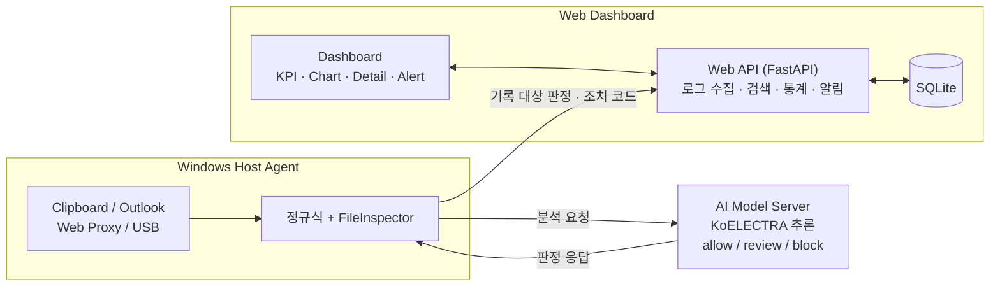
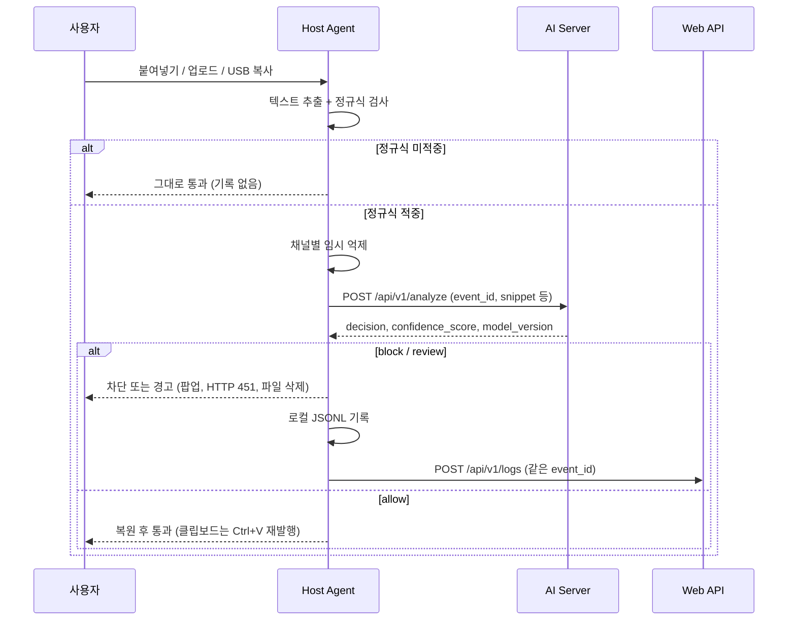

# Sentry: 민감정보 파일 반출 탐지를 위한 AI 기반 Host DLP

2026 전기 부산대학교 정보컴퓨터공학부 졸업과제 43조 · 지도교수 최윤호

Windows 단말에서 클립보드, Outlook, 웹메일·클라우드 업로드, USB 복사로 민감정보가 빠져나가는 순간을 감지하고, 정규식 1차 탐지 후 KoELECTRA 문맥 분석으로 재판정하여 차단·검토·허용을 결정합니다. 판정 결과와 조치 기록은 중앙 웹 대시보드에서 조회·통계·위험 알림으로 확인합니다.

---

## 1. 프로젝트 배경

### 1.1. 국내외 시장 현황 및 문제점

업무 문서는 더 이상 하나의 사내 프로그램 안에 머물지 않습니다. 웹메일로 전송되고, 메신저 입력창에 붙여넣어지고, 클라우드 저장소와 USB로 복사됩니다. 이 과정에서 주민등록번호·계좌번호 같은 개인정보뿐 아니라 계약 단가, 인사 계획, 연구개발 자료처럼 형식이 정해지지 않은 업무 기밀도 외부로 이동할 수 있습니다.

기존 방식에는 다음과 같은 한계가 있습니다.

- **네트워크 구간 탐지의 한계**: HTTPS/TLS 암호화로 인해 패킷만으로는 파일 내부를 판단하기 어렵습니다.
- **사후 로그의 한계**: 운영체제 이벤트와 감사 로그는 사건 조사에는 유용하지만, 기록 시점에는 이미 전송이 끝난 경우가 많습니다.
- **정규식 탐지의 한계**: 구조가 고정된 개인정보는 빠르게 찾지만, 같은 형식이 예시인지 실제 정보인지 구분하지 못하고, "다음 분기 인수 제안 가격"처럼 패턴이 없는 기밀 문장은 찾지 못합니다.
- **정상 도구를 통한 유출**: 정상 권한 사용자가 Chrome, Outlook, 파일 탐색기 같은 정상 프로그램을 사용하는 경우 악성코드 탐지로는 위험을 판별할 수 없습니다. 악의적 내부자뿐 아니라 수신자 선택 오류, 잘못된 첨부 같은 실수도 같은 결과를 낳습니다.

### 1.2. 필요성과 기대효과

단말(Host)에서는 암호화되기 전의 텍스트와 파일, 사용 중인 프로그램, 목적 채널을 함께 관찰할 수 있습니다. 따라서 반출 동작과 가장 가까운 Host에서 후보를 감지하고, 판정과 조치 결과를 중앙에서 추적하는 구조가 필요합니다.

- **반출 시점 차단**: 전송 이후 흔적을 찾는 대신, 붙여넣기·업로드·복사 시점에 개입합니다.
- **오탐 감소**: 정규식이 걸러낸 후보만 AI가 문맥으로 재판정하여, 형식만 일치하는 비민감 문장을 통과시킵니다.
- **설명 가능한 관제**: 매칭 규칙, AI 점수, 판정 사유, 조치 코드를 한 사건 단위로 저장하여 관리자가 "왜 차단되었는가"를 확인하고 정책을 조정할 수 있습니다.

---

## 2. 개발 목표

### 2.1. 목표 및 세부 내용

Windows Host Agent, AI Model Server, Web Dashboard를 동일한 데이터 계약으로 연동하는 Host DLP 프로토타입을 구현하고, 감지부터 중앙 표시까지를 재현 가능한 방법으로 검증하는 것이 목표입니다.

| 구분 | 목표 | 주요 기능 |
|---|---|---|
| Host Agent | 반출 채널 감시와 실제 조치 | 클립보드·Outlook·HTTPS Web Proxy(웹메일/클라우드)·USB 감시, 파일 텍스트 추출, 정규식 1차 탐지, AI 요청, 채널별 차단 |
| AI Model Server | 한국어 문맥 기반 재판정 | KoELECTRA 이진 분류, 두 임계값 기반 allow / review / block 3단계 결정 |
| Web Dashboard | 중앙 관제 | 로그 수집(중복 방지), 조건 검색, 최근 7일 통계, 상세 판정 근거, 준실시간 위험 알림 |
| 통합 | 한 사건의 추적 | 동일 `event_id`로 감지–판정–조치–저장 연결 |

### 2.2. 기존 서비스 대비 차별성

| 구분 | 일반적인 정규식 기반 DLP | Sentry |
|---|---|---|
| 판정 방식 | 패턴 일치 여부만 판단 | 정규식 후보를 KoELECTRA로 문맥 재판정 (하이브리드) |
| 비정형 기밀 | 패턴이 없으면 판단 불가 | 후보 문맥의 업무 맥락으로 민감도 판정 |
| 판정 단계 | 차단 / 허용 이분법 | allow / review / block 3단계, 애매한 구간은 검토로 분리 |
| 결과 기록 | 차단 여부 중심 | AI 판정과 실제 조치를 분리 기록, AI 장애 상태(FAILED)도 별도 보존 |
| 한국어 | 범용 패턴 위주 | 한국어 사전학습 모델 기반, 구어체·격식체 데이터 보강 |

상용 DLP의 전체 기능을 재현하는 것이 아니라, 다중 채널 감지·한국어 문맥 분석·중앙 관제의 핵심 흐름을 세 구성 요소로 분리하고 API 계약으로 연결한 데 의미가 있습니다.

### 2.3. 사회적 가치 도입 계획

- **개인정보 보호**: 실수로 인한 개인정보·기밀 유출을 반출 시점에 막아 정보 주체의 피해를 줄입니다.
- **중소기업 보안 격차 완화**: 고가의 상용 DLP 도입이 어려운 조직도 참고할 수 있도록 설계와 코드를 공개합니다.
- **개인정보 최소 처리**: 모든 입력이 아니라 정규식 후보만 AI로 보내 원문 노출 범위를 줄이는 구조를 택했습니다.
- **재현 가능한 연구 자료**: 학습·평가 데이터(합성 데이터)와 검증 스크립트를 함께 공개합니다.

---

## 3. 시스템 설계

### 3.1. 시스템 구성도



분석 요청(Host→AI)과 관제 로그(Host→Web)는 서로 다른 경로로 전송됩니다. Web이 일시 중단되어도 Host의 판정과 조치는 지연되지 않고, AI 서버는 Web DB에 의존하지 않습니다.

### 3.2. 사용 기술

| 구성 요소 | 기술 |
|---|---|
| Host Agent | Python, Windows API (WH_KEYBOARD_LL 키보드 훅, ReadDirectoryChangesW), Outlook COM, mitmproxy 기반 HTTPS 프록시 |
| AI Model Server | Python, PyTorch, Hugging Face Transformers, `monologg/koelectra-base-v3-discriminator`, FastAPI, Uvicorn, Cloudflare Tunnel, Google Colab (T4 GPU) |
| Web Dashboard | Python 3.10+, FastAPI 0.135.2, Uvicorn 0.42.0, SQLite, HTML/CSS/JavaScript, Chart.js |
| 테스트 | pytest, Playwright (Chromium) |

---

## 4. 개발 결과

### 4.1. 전체 시스템 흐름도



AI 서버가 응답하지 않으면 Host는 Fail-Closed로 처리하여 차단하고, 중앙에는 `analysis_status=FAILED`, 점수 NULL로 기록합니다.

### 4.2. 기능 설명 및 주요 기능 명세서

**Host Agent**

| 채널 | 감지 방식 | block | review | allow |
|---|---|---|---|---|
| 클립보드 | Ctrl+V 키보드 훅 | 붙여넣기 억제 + 팝업 | 억제 + 팝업 | 클립보드 복원 후 Ctrl+V 재발행 |
| 웹메일 · 클라우드 | HTTPS 프록시(8082), 웹메일 14개 도메인, Drive·MYBOX·OneDrive·Dropbox·Box | HTTP 451 | HTTP 451 | 통과 |
| USB | 이동식·외장 드라이브 파일 변경 감시 | 복사 후 파일 삭제 + 팝업 | 파일 유지, 로그만 기록 | 통과 |
| Outlook | COM ItemSend | 외부 수신자 메일을 정규식 단계에서 임시보관함 이동 | | |

- 텍스트 추출 지원: txt·소스코드·csv 등 텍스트 계열, docx·xlsx·xls·pptx, pdf, hwp·hwpx(부분), zip(내부 최대 50개)
- 모든 탐지 이벤트는 로컬 `logs/events.jsonl`에 먼저 기록되고, 전송 실패분은 재전송할 수 있습니다.

**AI Model Server**

| 입력 | 출력 |
|---|---|
| `event_id`, `channel`, `user_id`, `matched_patterns`, `snippet`, `metadata` | `decision`, `confidence_score`, `model_version`, `latency_ms`, `reason` |

| confidence_score | decision |
|---|---|
| ≥ 0.41 | block |
| 0.20 ~ 0.41 | review |
| < 0.20 | allow |

**Web Dashboard**

| 엔드포인트 | 기능 |
|---|---|
| `POST /api/v1/logs` | Host 로그 수신. Agent Token 인증, 신규 201 / 동일 재전송 200 / 다른 내용 충돌 409 |
| `GET /api/v1/logs` | 기간·부서·사용자·Agent·채널·조치·검색어 조건 조회, 페이지 단위 |
| `GET /api/v1/logs/{log_id}` | 사건 상세 (AI 점수, 판정 사유, 매칭 패턴, 조치) |
| `GET /api/v1/dashboard/summary` | 최근 7일 KPI, 날짜·채널·부서별 집계 |
| `GET /api/v1/alerts` | 2초 폴링 기반 위험 알림 (BLOCKED 또는 점수 0.85 이상) |

**검증 결과 요약**

| 항목 | 결과 |
|---|---|
| Web 자동화 시험 | API·DB·스크립트 128건 + Playwright E2E 3건, 총 131건 통과 |
| Host 전송 계약 시험 | Web payload 계약 4건 통과 |
| Host 성능 (4채널 × 34개 형식 × 5개 크기, 680 케이스) | 10KB~1MB 파일 기준 클립보드·웹메일·클라우드 전체 응답 700~950ms, USB 약 3초(복사 완료 대기 1초 포함). AI 추론 240~295ms |
| AI 모델 | 학습 미사용 데이터로 보조 검증 수행 (상세: [`ai-server/docs`](ai-server/docs)). 독립 평가 세트를 사전에 고정한 최종 성능 평가는 후속 과제 |

**한계**

- 정규식이 찾지 못한 비정형 기밀 문장은 AI 분석 대상이 되지 않습니다.
- USB는 복사 전 차단이 아니라 사후 삭제 방식입니다.
- `BLOCKED`는 조치 시도를 의미하며, 실제 삭제·차단 성공을 보증하지 않습니다.
- Windows 전 채널을 연결한 실장비 통합 E2E와 CPU·메모리 사용률 측정은 후속 과제입니다.

### 4.3. 디렉토리 구조

```
capstone-2026-team-43/
├── host-agent/        # Windows Host Agent (김진우)
├── ai-server/         # AI 판별 서버 · 학습 · 평가 (박동화)
│   ├── server/        #   서버 실행 (Colab 노트북, 로컬 스크립트)
│   ├── training/      #   KoELECTRA 학습
│   ├── evaluation/    #   하드케이스 평가, threshold 분석, 라이브 배치 테스트
│   ├── legacy/        #   v6 단계 스크립트
│   ├── data/          #   학습·평가 데이터 (합성)
│   └── docs/          #   검증 결과, 통합 테스트 시나리오
├── web-dashboard/     # 중앙 관제 웹 (이상호)
├── docs/              # 착수·중간·최종 보고서, 발표 자료
└── README.md
```

각 폴더의 상세 구조는 폴더별 README를 참고하세요.

### 4.4. 산업체 멘토링 의견 및 반영 사항

본 과제는 산업체 멘토링을 진행하지 않았습니다.

---

## 5. 설치 및 실행 방법

### 5.1. 설치절차 및 실행 방법

**실행 환경**

- Host Agent: Windows 10/11 64-bit, Python
- AI Server: Google Colab (T4 GPU) 또는 로컬 PC
- Web Dashboard: Python, 최신 Chrome/Edge 브라우저

**실행 순서**

AI Server → Web Dashboard → Host Agent 순서로 실행합니다. 세부 옵션은 각 폴더의 README를 참고하세요.

**1) AI Server** ([`ai-server/README.md`](ai-server/README.md))

- Colab: `ai-server/server/server_colab.ipynb`를 GPU 런타임에서 열고 셀 1~3 실행
- 로컬: 모델 가중치를 `ai-server/server/model/`에 두고 실행
  ```bash
  cd ai-server
  pip install -r requirements.txt
  cd server
  python server_local.py
  ```
- 실행 후 출력되는 `https://xxxx.trycloudflare.com` 주소를 복사합니다. 이 주소는 실행할 때마다 바뀝니다.

**2) Web Dashboard** ([`web-dashboard/README.md`](web-dashboard/README.md))

```bash
cd web-dashboard
python -m venv .venv
.venv\Scripts\Activate.ps1
python -m pip install -r requirements.txt
copy .env.example .env        # AGENT_API_TOKEN을 32자 이상 값으로 교체
python -m uvicorn backend.main:app --host 127.0.0.1 --port 8000 --env-file .env
```

- 대시보드: `http://127.0.0.1:8000/dashboard`, 로그 화면: `/logs`, API 문서: `/docs`, 상태 확인: `/health`
- 다른 PC에서 대시보드를 볼 때는 `--host`에 서버 PC의 LAN IP를 넣습니다.

**3) Host Agent** ([`host-agent/README.md`](host-agent/README.md))

```bash
cd host-agent
python -m venv venv
venv\Scripts\activate
pip install -r requirements.txt
```

- 관리자 권한 PowerShell에서 `setup_proxy.ps1` 실행 (CA 인증서 설치와 시스템 프록시 설정, 웹메일·클라우드 채널에 필요)
- `config/settings.yaml` 설정
  ```yaml
  server:
    dashboard_url: "http://127.0.0.1:8000"
    dashboard_token: "<Web의 AGENT_API_TOKEN과 같은 값>"
    # AI 서버 주소: 1)에서 복사한 터널 URL
  logging:
    send_immediately: true
  ```
- AI 서버 주소를 비워두면 정규식만으로 판정하는 mock 모드로 동작합니다.
- 실행
  ```bash
  python main_agent.py
  ```

> AI Server를 로컬(`server_local.py`)로 같은 PC에서 실행하면 Web Dashboard와 둘 다 8000번 포트를 사용합니다. 이 경우 Web의 `--port`를 다른 번호(예: 8001)로 바꾸고 `dashboard_url`도 맞춰주세요.

### 5.2. 오류 발생 시 해결 방법

| 증상 | 원인 및 해결 |
|---|---|
| Host가 AI 서버에 연결하지 못하고 모든 후보를 차단함 | 터널 URL이 바뀌었습니다. AI 서버를 다시 실행해 새 URL을 `settings.yaml`에 반영하세요. |
| AI 서버가 503 반환 | 모델 가중치가 로드되지 않았습니다. 모델 경로를 확인하세요. |
| 웹메일·클라우드 업로드가 감지되지 않음 | `setup_proxy.ps1`로 CA 인증서와 프록시 설정이 적용됐는지 확인하세요. |
| USB 소형 파일이 삭제되지 않음 | 사후 삭제 방식 특성상 수 KB 이하 파일은 삭제 전에 복사가 끝날 수 있습니다. |
| 시연 후 인터넷이 이상함 | 시스템 프록시와 CA 설정을 원래대로 복구하세요. |

---

## 6. 소개 자료 및 시연 영상

### 6.1. 프로젝트 소개 자료

- [착수·중간·최종 보고서](docs/01.보고서)
- [포스터](docs/02.포스터)
- [발표자료](docs/03.발표자료)

### 6.2. 시연 영상

[](https://www.youtube.com/watch?v=dbiJP5NrhN8)

---

## 7. 팀 구성

### 7.1. 팀원별 소개 및 역할 분담

| 이름 | 담당 | 주요 수행 내용 | 연락처 |
|---|---|---|---|
| 박동화 | AI Model | 데이터셋 구성, 도메인 편향 분석과 재설계, KoELECTRA 학습·검증, 구어체 데이터 보강, 임계값 설정, AI 분석 서버, 통합 테스트 시나리오 | hvva1816@gmail.com |
| 김진우 | Host Agent | Windows Agent 구조, Clipboard, Outlook·SMTP, Web Proxy, USB FileGuard, 파일 추출, 규칙–AI–조치 파이프라인, Host 벤치마크 | a01047463862@gmail.com |
| 이상호 | Web · 통합 | FastAPI·SQLite, Dashboard/Logs UI, 검색·위험 알림, 입력 검증·멱등 저장, 구성 요소 간 API 연동 | ttt1253@naver.com |

공통: 요구사항·아키텍처 설계, JSON/REST 계약과 시연 시나리오 합의, 최종 보고서와 발표 준비

### 7.2. 팀원 별 참여 후기

- **박동화 (AI 모델)**: AI 모델과 판별 서버를 맡아 KoELECTRA 문맥 분류 모델을 학습하고 서버로 연결했습니다. 처음 만든 모델이 문맥이 아니라 '보안', '대외비' 같은 키워드에만 반응하고 있다는 걸 알았을 때, 정확도 숫자만 믿으면 안 된다는 걸 실감했습니다. 데이터를 다시 설계하고 구어체 오판정을 재학습으로 고치는 과정을 반복하며, 성능을 높이는 것만큼 그 수치를 얼마나 믿을 수 있는지 검증하는 게 중요하다는 걸 배운 시간이었습니다.
- **김진우 (Host Agent)**:
- **이상호 (Web · 통합)**:

---

## 8. 참고 문헌 및 출처

1. J. Devlin, M.-W. Chang, K. Lee, and K. Toutanova, "BERT: Pre-training of Deep Bidirectional Transformers for Language Understanding," *Proceedings of NAACL-HLT*, 2019.
2. K. Clark, M.-T. Luong, Q. V. Le, and C. D. Manning, "ELECTRA: Pre-training Text Encoders as Discriminators Rather Than Generators," *ICLR*, 2020.
3. J. Park, "KoELECTRA: Pretrained ELECTRA Model for Korean," 2020. https://github.com/monologg/KoELECTRA
4. National Institute of Standards and Technology, *Security and Privacy Controls for Information Systems and Organizations*, NIST SP 800-53 Rev. 5, 2020. https://doi.org/10.6028/NIST.SP.800-53r5
